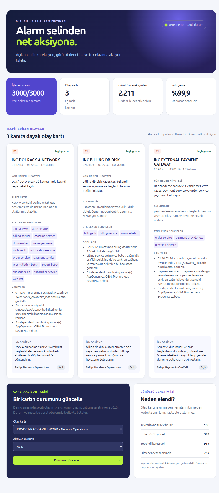
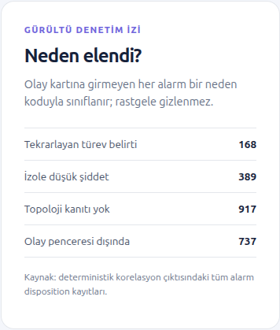

# ao-hackathon-2026-mithril

## Proje adı ve tek cümlelik özet
**ao-hackathon-2026-mithril** — 3.000 operasyon alarmını üç açıklanabilir olay kartına indirgeyen ve her hipotezi ham verisiyle doğrulatan yerel demo.

## Çözdüğünüz problem
Etkinlik gününde açıklanan senaryo ve veri setinden operasyonel sinyalleri çıkarıp karar almayı hızlandırmak.

## Çözümünüzün nasıl çalıştığı
1. Tüm alarm kayıtlarını, host envanterini ve yönlü servis bağımlılıklarını doğrular.
2. Zaman, topoloji ve bağımlılık kanıtlarıyla olayları korele eder; kart dışı kayıtları gerekçeli gürültü olarak sınıflandırır.
3. Her kart için kök neden hipotezi, karşı olasılık, etki alanı ve ilk aksiyonu üretir.
4. Seçilen kartın ham alarm verisini, zaman yoğunluğu ve dağılım görselleştirmeleriyle doğrulatır.

## Kurulum adımları

Bu demo yalnızca Python standart kütüphanesini kullanır. Paket kurulumu, `.env`
dosyası, veritabanı veya dış servis gerekmez.

1. Python 3.12+ ile proje köküne gelin.
2. Otomatik testleri çalıştırın:

	```bash
	make test
	```

3. Yerel demo sunucusunu başlatın:

	```bash
	make run
	```

4. Tarayıcıda `http://127.0.0.1:8000` adresini açın. Sunucuyu kapatmak için
	terminalde `Ctrl+C` kullanın.

## Çalıştırma komutu
`make run`, `docs/project/senaryo/` altındaki kanonik senaryo verisini doğrudan
okur ve `src/alarm_core.py` ile korelasyon sonucunu üretir. Girdi senaryo
dosyaları kopyalanmaz veya değiştirilmez.

## Canlı demo akışı

1. Özet metrikte tüm veri paketinin `3000/3000` işlendiğini, olay kartı
	sayısının `≤15` olduğunu gösterin.
2. Üç olay kartında kök neden hipotezini, alternatif açıklamayı, kanıtları,
	etkilenen servisleri ve önerilen ilk aksiyonu açın.
3. **Ham Veriyle Hipotez Doğrulama** alanından bir kart seçip ham veriyi
	yükleyin. Zaman yoğunluğu, alarm tipi, servis ve veri merkezi/kabin
	görselleştirmeleri karttaki hipotezi doğrular.
4. Ham alarm tablosunda öncül ve türev etkileri gösterin; ardından **Gürültü
	Denetim İzi** alanında kart dışı alarmların neden kodları ile
	(izole düşük şiddet, topoloji kanıtı yok, tekrarlayan türev belirti, olay
	penceresi dışında) sayıldığını gösterin.

## Teknik notlar

- Uygulama: `src/demo_server.py` (`http.server` tabanlı yerel sunucu)
- Korelasyon: `src/alarm_core.py` (deterministik ve açıklanabilir kurallar)
- Arayüz varlıkları: `src/demo_assets/`
- Hipotez doğrulama paneli, kanonik senaryo verisinden anlık türetilen ham
	alarm özetleri ve görselleştirmeleri gösterir.

## Kullanılan Python kütüphaneleri

Proje harici Python paketi gerektirmez; yalnızca Python standart kütüphanesi
kullanılır:

- Veri ve korelasyon: `argparse`, `csv`, `json`, `collections`, `datetime`,
	`pathlib`, `typing`
- Yerel demo sunucusu: `http.server`, `mimetypes`, `urllib.parse`
- Test: `unittest`

## Geliştirme ve UI doğrulama aracı

- **Playwright:** Yerel demonun tarayıcı üzerinden doğrulanması ve teslim ekran
	görüntülerinin alınması için kullanıldı. Uygulamanın çalışma zamanı
	bağımlılığı değildir; `make run` için ek paket kurulumu gerektirmez.

## Kullanılan tüm AI araçları ve model sürümleri
- GitHub Copilot — model: `SAKA gpt-5.6-terra`; kod, test, dokümantasyon ve korelasyon analizi desteği.
- Claude SAKA / Codex — ekip tarafından kullanılabilecek araçlar; bu repoda sürüm bilgisi kaydedilmeden bir model çıktısı ürün kararına bağlanmamıştır.
- Kritik prompt ve insan denetimi kaydı: `prompts/prompt-01-scenario-analysis.md`.

## MCP sunucu listesi
- Bu MVP'de MCP sunucusu kullanılmadı.

## Entegre edilen API'ler
- Harici API kullanılmadı. Demo, verilen sentetik veri paketiyle yerelde çalışır.

## Ekran görüntüleri

### Alarm karar merkezi


### Ham veriyle hipotez doğrulama
Ham veri doğrulama paneli yerel demoda etkileşimli olarak çalışır. Seçilen olay
kartı için zaman yoğunluğu, alarm türü, servis ve DC/kabin dağılımı üretilir.

### Gürültü denetimi


## Deploy URL ve bilinen sınırlar
- Deploy URL: Yerel demo — `http://127.0.0.1:8000` (`make run` sonrası).
- Bilinen sınırlar:
	- Korelasyon kuralları S-A1 senaryosundaki kanıt eşiklerine göre deterministiktir; farklı senaryolarda eşikler yapılandırılmalıdır.
	- Ham veri görselleştirmeleri S-A1 senaryosuna aittir; farklı veri paketleri için yeni korelasyon kuralları ve eşikler gerekebilir.

## Takım
- Alper
- Altan
- Yiğit
