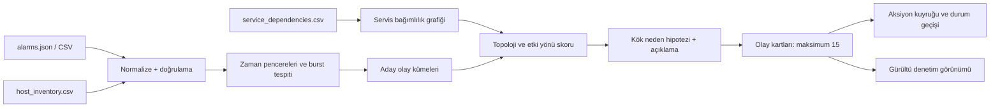

# S-A1 Alarm Fırtınası — Teknik Analiz

**Tarih:** 16 Eylül 2026  
**Amaç:** 3.000 alarmı, nöbetçi mühendisin yedi dakika içinde değerlendirebileceği açıklanabilir olay kartlarına indirgeyen demo-güvenli MVP için teknik karar çerçevesi.

## 1. Senaryo ve Başarı Hedefi

Problem bir alarm listeleme problemi değildir. Aynı iki saatlik pencerede bağımsız olaylar, bunların türev etkileri ve arka plan gürültüsü birlikte üretilmektedir. Çözümün görevi:

1. Veri paketinin tamamını okumak ve normalize etmek.
2. Alarmları nedensel olarak tutarlı olay kümelerine ayırmak.
3. Her küme için tek olay kartı üretmek.
4. Kök neden hipotezi, gerekçesi, etkilenen servisler, alarm sayısı, zaman aralığı ve ilk aksiyonu görünür yapmak.
5. Aksiyonu sahip ve durum bilgisiyle izlemek.

Kabul kriteri, 3.000 alarmın **en fazla 15 olay kartına** indirilmesidir. İndirgeme tek başına hedef değildir; ilgisiz olayları birleştirmemek ve gerekçeli kök neden hipotezi üretmek daha değerlidir.

## 2. Veri Paketi: Doğrulanmış Profil

| Boyut | Bulgular |
|---|---:|
| Alarm | 3.000 |
| Zaman aralığı | 10 Eylül 2026, 01:30:20–03:30:20 |
| Servis | 27 |
| Host | 56 |
| Kaynak sistem | 5: SyslogNG, Zabbix, OBM, AppDynamics, Prometheus |
| Alarm tipi | 25 farklı tip gözlendi; veri sözlüğünde 26 tip tanımlı |
| Şiddet | S1: 614, S2: 709, S3: 800, S4: 629, S5: 248 |
| Bağımlılık | 32 kayıt; 25 senkron, 7 asenkron |
| Envanter | 56 host; dc1: 28, dc2: 28; rack-A: 18, rack-B: 19, rack-C: 19 |
| İş kritikliği | kritik: 36, yüksek: 10, orta: 6, düşük: 4 |

Öne çıkan yoğun servisler: `mobile-bff` (278), `payment-service` (227), `subscriber-service` (212), `charging-service` (205), `order-service` (199) ve `billing-service` (188). Bu yoğunluk **tek başına kök neden kanıtı değildir**; olay kümelemesi zaman, topoloji ve etki yönüyle yapılmalıdır.

Bağımlılık grafiğinde en çok bağımlı olunan hedefler `session-service`, `subscriber-db` ve `batch-scheduler` (üçer giriş) olarak görünür. Bunlar olası etki yayılımı analizinde öncelikli adaylardır.

## 3. Önerilen MVP Mimarisi



### Bileşen sorumlulukları

| Katman | Sorumluluk | Deterministik MVP yaklaşımı |
|---|---|---|
| Veri girişi | JSON/CSV ve referans dosyalarını okuma | Varsayılan `alarms.json`; tüm 3.000 kaydı sayısal olarak doğrula |
| Normalizasyon | Zaman, severity, tag ve servis/host eşlemesi | Şema kontrolü; eksik kaydı görünür hata olarak raporla |
| Korelasyon | Aday olay kümeleri üretme | Zaman yakınlığı + aynı host/rack/DC + servis bağımlılığı |
| Hipotezleme | Muhtemel kök neden ve alternatifleri | Kurallı skor ve açık kanıt listesi |
| Aksiyon | İlk aksiyon, sahip, durum | Bellek içi; `open → investigating → mitigated/closed` |
| Sunum | Olay kartları ve denetim görünümü | Tek mutlu yol + bir aksiyon durum geçişi |

Kalıcı veritabanı, gerçek zamanlı akış ve kimlik doğrulama kapsam dışıdır. Demo güvenilirliği için sistem önce **tamamen deterministik** çalışmalıdır; LLM yalnızca açıklama metnini iyileştiren opsiyonel katman olabilir.

## 4. Korelasyon Stratejisi

### 4.1 Normalizasyon ve ön koşullar

- `alarm_id` benzersizliği, ISO-8601 zaman damgası, severity $\in [1,5]$ ve servis-host envanter eşleşmesi kontrol edilir.
- `service_dependencies.csv` yönlü grafik olarak okunur: `kaynak_servis → hedef_servis`. Hedefteki arıza, kaynağı etkileyebilir.
- Alarm mesajı yardımcı sinyaldir; tek başına kümelenme anahtarı değildir.
- JSON ve CSV aynı içeriği taşıdığı için MVP yalnızca birini işler; diğerini doğrulama veya alternatif giriş olarak destekleyebilir.

### 4.2 Aday olay üretimi

Aşağıdaki sinyaller birlikte değerlendirilmelidir:

1. **Zamansal yakınlık:** 5 dakikalık kayan pencere ile alarm yoğunluğu artışlarını tespit et. Ani patlamalar yanında uzun süreli olaylar için komşu pencereleri birleştir.
2. **Altyapı ortaklığı:** Aynı host, rack veya veri merkezinde eşzamanlı `network_*`, disk, bellek ya da CPU sinyallerini ilişkilendir.
3. **Servis topolojisi:** Önce bağımlılık grafiğinin hedef tarafında görülen ve sonrasında kaynak servislerde `timeout`, `conn_refused`, `http_5xx` veya `latency_high` üreten adayları güçlendir.
4. **Şiddet ve iş kritikliği:** Severity ile envanter `is_kritikligi` kart önceliğini artırır; ancak düşük şiddetli, uzun süreli birikim kümeleri dışlanmaz.
5. **Kaynak sistem çeşitliliği:** Aynı iddiayı iki ya da daha fazla izleme sisteminin desteklemesi güveni artırır.

### 4.3 Birleştirme koruması

Yanlış birleştirmeyi azaltmak için iki aday küme yalnızca şu koşullarda birleştirilir:

- zaman aralıkları çakışır veya tanımlı yakınlık eşiği içindedir,
- ortak altyapı sinyali **veya** grafikte açıklanabilir tek yönlü bağımlılık yolu vardır,
- etkilenme sırası nedensel yönle uyumludur.

Aynı alarm tipi veya aynı severity, tek başına birleştirme gerekçesi değildir.

### 4.4 Kök neden skoru

Her küme içindeki servis/host adayları için açıklanabilir bir skor kullanılabilir:

$$
S(r) = 0.30T + 0.25D + 0.20I + 0.15V + 0.10C
$$

- $T$: olaydaki erkenlik ve zamansal öncüllük
- $D$: bağımlılık grafiğinde aşağı akış etkisini açıklama gücü
- $I$: altyapı sinyali gücü (network, disk, bellek vb.)
- $V$: severity ve iş kritikliği
- $C$: farklı kaynak sistemlerden gelen kanıt

Ağırlıklar MVP için konfigürasyon dosyasına alınmalı ve kart üzerinde skor yerine anlaşılır kanıt maddeleri gösterilmelidir. En yüksek aday kök neden hipotezi, ikinci güçlü aday ise **karşı olasılık** olarak sunulur.

## 5. Olay Kartı ve Aksiyon Veri Sözleşmesi

Her kart aşağıdaki alanları taşımalıdır:

```text
incident_id
status                 # open | investigating | mitigated | closed
priority               # P1 | P2 | P3
start_at, end_at
alarm_count
noise_count
root_cause_hypothesis
confidence             # low | medium | high
alternative_hypothesis
affected_services[]
affected_hosts[]
evidence[]             # zaman, topoloji, altyapı, kaynak sistemi kanıtları
recommended_first_action
action_owner
action_status          # open | in_progress | done
```

Kartların sayısı $1 \leq n \leq 15$ olmalıdır. Karta alınmayan her alarm iki açıklanabilir gruptan birinde olmalıdır:

- başka olay kartının türev etkisi,
- gürültü (`noise_reason` ile).

Bu yaklaşım, tüm 3.000 alarmın işlendiğini ve hiçbirinin sessizce kaybolmadığını gösterir.

## 6. X-Factor İçin En Yüksek Getirili Özellikler

Önerilen öncelik sırası:

1. **Gerekçeli kök neden + karşı olasılık:** Her kartta "neden bu aday?" ve "neden şu aday değil?" göstermek. Jürinin düşünme süreci beklentisiyle doğrudan uyumludur.
2. **Gürültü denetim görünümü:** Gürültü alarmı için "tekil/tekrarsız", "olay penceresi dışında", "topoloji kanıtı yok" gibi nedenleri göster.
3. **Aksiyon yaşam döngüsü:** En az bir kartta aksiyonu `open → investigating → closed` geçişiyle canlı göster.
4. **Geçmiş örüntü eşleştirme:** Veri paketi geçmiş olay veri seti içermediğinden bu özellik ek veri olmadan spekülatif kalır; son önceliktir.

## 7. Demo Akışı (7 Dakika)

1. **0:00–0:45 — Problem:** 3.000 alarm, 2 saat, nöbetçi için yedi dakika.
2. **0:45–1:30 — İşleme kanıtı:** Giriş sayacı 3.000/3.000; topoloji/enventerin kullanıldığını göster.
3. **1:30–4:30 — Olay kartları:** En kritik 2–3 kartta hipotez, zaman çizgisi, etkilenen servisler, kanıt ve karşı olasılığı aç.
4. **4:30–5:30 — Gürültü denetimi:** Bir alarmın neden olay kartına alınmadığını göster.
5. **5:30–6:30 — Aksiyon:** Sahipli aksiyonu durum değiştirerek kapat.
6. **6:30–7:00 — Sonuç:** İndirgeme oranı, açık olaylar ve operasyonel değer.

Q&A için hazırlanacak cevaplar: küme sayısı eşiği, neden seçilen kök neden, yanlış birleştirmeyi nasıl engellediğimiz, LLM'in deterministik çekirdeğe etkisi ve tüm alarmların izlenebilirliği.

## 8. Riskler ve Önlemler

| Risk | Etki | Önlem |
|---|---|---|
| Sadece alarm türüne göre kümeleme | Yanlış birleştirme | Zaman + topoloji + nedensel yön zorunluluğu |
| Yalnız ani patlamaları yakalamak | Uzun süreli olayları kaçırma | Kayan pencere ve komşu pencere birleştirme |
| LLM çıktısına bağımlılık | Demo kararsızlığı | Kural tabanlı hipotez; LLM yalnız isteğe bağlı metin iyileştirmesi |
| 15 kart sınırını aşmak | Kabul kriteri ihlali | Skorla sırala; düşük kanıtlı kümeleri denetimli gürültü/etki olarak ayır |
| Kart sayısını aşırı düşürmek | Bağımsız olayları birleştirme | Birleştirme koruması ve karşı kanıt gösterimi |
| Veri paketini repoya taşımak | Senaryo yönergesi ihlali | Girdi yolunu dokümante et; orijinal veri paketini yeniden commit etme |

## 9. Uygulama Planı ve Rol Dağılımı

| Sıra | İş | Sorumlu |
|---:|---|---|
| 1 | Veri sözleşmesi, profil ve korelasyon prototipi | Data & AI Engineer |
| 2 | Olay/Aksiyon modelleri ve deterministik skorlar | Data & AI Engineer |
| 3 | Olay kartları, detay görünümü, gürültü denetimi | Full-stack Demo Engineer |
| 4 | Aksiyon durum geçişi ve demo akışı | Full-stack Demo Engineer |
| 5 | Tam veri işleme, ≤15 kart, README/submission kontrolü | QA & Release Engineer |
| 6 | Jüri kural denetimi ve raporlama | Jury Audit Agent |
| 7 | Kapsam, eşik ve sunum kararları | İnsan PM/DRI: Alper, Altan, Yiğit |

## 10. Birlikte Karar Verilecek Noktalar

1. Varsayılan uygulama yüzü: hızlı bir web paneli mi, terminal tabanlı canlı demo mu?
2. Zaman penceresi başlangıç eşiği: 5 dakika mı, adaptif yoğunluk penceresi mi?
3. Kök neden skoru için açıklanabilir sabit ağırlıklar mı, yoksa veri dağılımına uyarlanmış ağırlıklar mı?
4. Kart hedefi: operasyonel okunabilirlik için 5–10 arası mı, yoksa kanıt ayrışmasını korumak için 10–15 arası mı?
5. LLM kullanımının kapsamı: yalnızca açıklama üretimi mi, yoksa kullanıcı tarafından tetiklenen analiz önerisi mi?

## 11. İnsan Ekibi Olay Kartları ile Karşılaştırma

İnsan ekibinin hazırladığı üç olay kartı, bu dokümandaki korelasyon yaklaşımına gerçek veri üzerinden uygulanmış güçlü adaylardır. Aşağıdaki doğrulama, `alarms.json` ve `service_dependencies.csv` üzerinden yapılmıştır; kapalı doğrulama verisi henüz olmadığı için kök neden ifadeleri **hipotez** olarak kalmalıdır.

| Kart | Sonuç | Kanıt | Düzeltme / dikkat noktası |
|---|---|---|---|
| 1 — DC1 / Rack-A ağ altyapısı | **Güçlü hipotez** | `01:42:13–01:45:04` arasında yalnız `dc1/rack-A` üzerinde 34 adet `network_down`/`pkt_loss` alarmı var. Aynı pencerenin toplamı 518 alarm ve 231'i `dc1/rack-A`; ardından çok sayıda timeout/HTTP 5xx/latency etkisi görülüyor. | Fiziksel switch arızası makul fakat doğrudan switch telemetrisi yoktur. Kart "rack-A ortak ağ katmanı" kök neden hipoteziyle, switch ise alt olasılık olarak gösterilmelidir. Etkilenen servis listesi, yalnız dört servis yerine ağ alarmı üreten tüm servisleri ya da "kritik örnekler" olarak etiketlenmiş alt kümeyi göstermelidir. |
| 2 — Billing veritabanı disk tükenmesi | **Güçlü başlangıç, bağımlılık düzeltmesi gerekli** | `billing-db` üzerindeki 17 `disk_full` alarmı `02:05–02:09` aralığında başlıyor. İlgili `db_write_fail`/`db_conn_pool` sinyalleri `02:05`ten itibaren görülüyor; toplam 81 ilgili alarm var. `billing-service` ve `invoice-batch`, `billing-db`ye senkron bağımlı. | `reconciliation-batch`, bağımlılık grafiğine göre `billing-db`ye değil `subscriber-db` ve `batch-scheduler`a bağlıdır; doğrudan etkilenen listeden çıkarılmalı veya "gözlenen, ilişki araştırılıyor" denmelidir. Disk alarmı 02:09'da biterken ikincil yazma/havuz sinyalleri 02:27'ye ve seyrek olarak 03:23'e uzar: kartta **başlangıç**, **birincil etki penceresi** ve **artçı alarmlar** ayrı gösterilmelidir. |
| 3 — Harici ödeme sağlayıcısı kesintisi | **Çok güçlü hipotez** | `payment-provider-gw` üzerindeki 24 `ext_slow`/`ext_unreach` alarmı `02:40–02:43`te yoğunlaşır. Grafikte `payment-service → payment-provider-gw` ve `order-service → payment-service` senkron yönleri bulunur. `payment-service`/`order-service` üzerindeki timeout, işlem hatası ve 5xx etkileri `02:41–03:01`e yayılır. | `03:00+` yerine veriyle uyumlu bitiş `03:01:16` veya "02:40–03:01" kullanılmalıdır. Aynı servislerde 01:44–01:53 ve 02:10–02:25 aralıklarında da etki tipi alarmlar vardır; bunlar bu karta katılmamalı, önceki/ayrı olaylar veya gürültü denetimi olarak ayrıştırılmalıdır. |

### Birleşik Demo Kartı Önerisi

İlk demo için bu üç kart korunmalıdır. Her kartta şu ayrım görünür olmalıdır:

- **Gözlem:** ölçülen alarm, konum ve zaman kanıtı.
- **Hipotez:** kanıtla desteklenen muhtemel kök neden.
- **Karşı olasılık:** örneğin Kart 1 için rack-A switch yerine ortak güç/üst ağ bağlantısı; Kart 2 için disk doluluğu yerine aynı anda başlayan uygulama yazma yükü.
- **Etkiler:** bağımlılık grafiğiyle doğrulanmış aşağı akış servisleri; yalnız eşzamanlı alarm veren servisler değil.
- **Aksiyon:** sahip, durum ve güncellenebilir yaşam döngüsü.

### Gürültü Denetimi İçin Netleştirme

`ntp_drift` ve `log_rotate` alarmları, olay kanıtı veya topoloji ilişkisi taşımıyorsa düşük öncelikli gürültü adayı olarak sınıflandırılabilir. Ancak `mem_high` otomatik gürültü kabul edilmemelidir: aynı hostta `gc_pressure`, `oom_risk`, `latency_high` veya servis etkisiyle zaman/topoloji ilişkisi varsa olay kanıtına dönüşebilir. Bu nedenle her gürültü kaydı için kural tabanlı bir `noise_reason` tutulmalıdır:

```text
isolated_low_severity | outside_incident_window | no_topology_evidence | duplicate_symptom
```

Bu karşılaştırma, insan ekibinin olay sezgisini deterministik korelasyon kurallarıyla birleştirir: kartlar demo için anlaşılır kalırken, jüri karşısında her iddia zaman, konum ve bağımlılık kanıtıyla savunulabilir olur.
